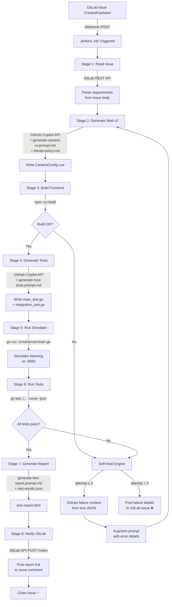

# Self-Healing CI/CD Architecture

## Overview

This document describes the end-to-end automated pipeline that uses **GitLab webhooks**, **Jenkins**, and the **GitHub Copilot API** to build, test, and self-repair the embedded camera web UI without human intervention.

---

## System Flow



---

## Component Roles

| Component | Tool | Role |
|-----------|------|------|
| **Issue Source** | GitLab | Requirement specification via issue body |
| **Webhook Trigger** | GitLab System Hooks | Fires POST to Jenkins on issue events |
| **Pipeline Orchestrator** | Jenkins (Declarative Pipeline) | Coordinates all stages and retry logic |
| **Code Generator** | GitHub Copilot API (chat/completions) | Transforms `.prompt.md` + context into source code |
| **Prompt Files** | `.github/prompts/*.prompt.md` | Agent skill instructions read by Copilot API |
| **Copilot Instructions** | `.github/copilot-instructions.md` | System-level constraints injected into every prompt |
| **Build System** | npm + Vite | Compiles Vue 3 TypeScript frontend |
| **Host Simulator** | Go stdlib HTTP server | Serves built `dist/` on embedded hardware emulation |
| **Test Suite** | Go `testing` + `httptest` | Validates hardware constraint logic without real hardware |
| **Report Generator** | Shell + Copilot API | Produces `test-report.html` from JSON test output |
| **Notification** | GitLab REST API | Posts results and closes/labels issues |

---

## Self-Healing Logic

The self-heal engine runs inside Jenkins using a **Groovy retry loop** (max 3 attempts by default, configurable via job parameter).

On each failed test run:

1. `scripts/self-heal.sh` parses `test-results.json` for `"Action":"fail"` entries.
2. Extracts the failing test names, output lines, and resolution/bitrate combinations that caused failures.
3. Builds an **augmented prompt** appending a `# Failures to Fix` section to the original `.prompt.md` content.
4. Re-invokes `scripts/copilot-generate.sh` with the augmented prompt.
5. Pipeline returns to the Build stage and reruns the full cycle.

After **3 consecutive failures**, Jenkins marks the build `UNSTABLE`, posts the full failure log to the GitLab issue as a comment, and applies the `needs-human` label.

---

## Credentials Required (Jenkins Credentials Store)

| Jenkins Credential ID | Type | Purpose |
|----------------------|------|---------|
| `GITLAB_TOKEN` | Secret text | Read/write GitLab issues via REST API |
| `GITLAB_API_URL` | Secret text | e.g. `https://gitlab.example.com/api/v4` |
| `GITHUB_TOKEN` | Secret text | Call GitHub Copilot / Models API |
| `COPILOT_API_URL` | Secret text | `https://models.inference.ai.azure.com` (or Copilot endpoint) |

---

## GitLab Webhook Setup

In your GitLab project → **Settings → Webhooks**:

```
URL:                  http://<jenkins-host>/project/<job-name>
Trigger Events:       Issues events
Secret Token:         <your-jenkins-gitlab-secret>
SSL Verification:     enabled
```

Jenkins receives the webhook payload and extracts `object_attributes.iid` (issue number) and `object_attributes.description` (issue body) via `jq`.

---

## Prompt Injection Strategy

Each Copilot API call assembles a message payload in this order:

```
[System Message]
  Content of .github/copilot-instructions.md    ← hardware constraints
  Content of docs/specs/bitrate-policy.md       ← bitrate policy spec

[User Message]
  Content of .github/prompts/<task>.prompt.md   ← agent skill/task instructions
  + Relevant source file contents for context   ← e.g. current CameraConfig.vue
  + Extracted GitLab issue body                 ← new requirements
  + (if self-heal) Failure details from JSON    ← what tests failed and why
```

This mirrors exactly how VS Code Copilot agent skills work, making the CI pipeline reproduce the same generation logic that runs in the IDE.

---

## Directory Structure (CI artifacts)

```
goWeb/
├── .github/
│   ├── copilot-instructions.md      # System prompt injected into all Copilot calls
│   └── prompts/
│       ├── generate-camera-ui.prompt.md     # Vue component skill
│       ├── generate-host-tests.prompt.md    # Go test skill
│       └── generate-test-report.prompt.md  # Report skill
├── scripts/
│   ├── read-gitlab-issue.sh         # Fetch & parse issue from GitLab API
│   ├── copilot-generate.sh          # Call Copilot API and apply generated code
│   ├── run-simulation.sh            # Start Go server, run go test, collect JSON
│   ├── generate-report.sh           # Build test-report.html from JSON results
│   ├── notify-gitlab.sh             # Post comment + label/close issue
│   └── self-heal.sh                 # Extract failures, augment prompt, retry
├── Jenkinsfile                      # Declarative pipeline definition
├── docs/
│   └── ci-architecture.md           # This document
└── test-results.json                # go test -json output (CI artifact)
```
